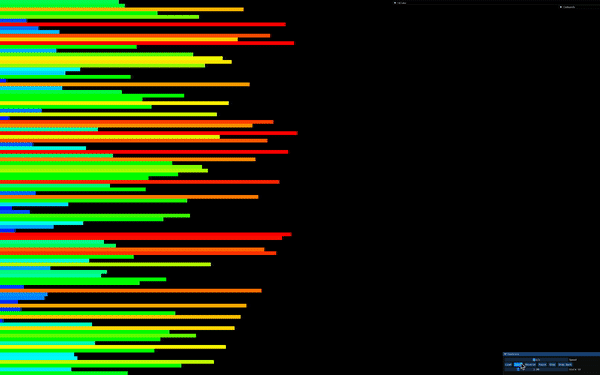
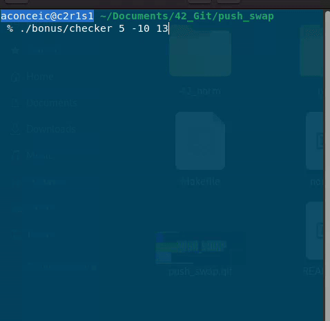
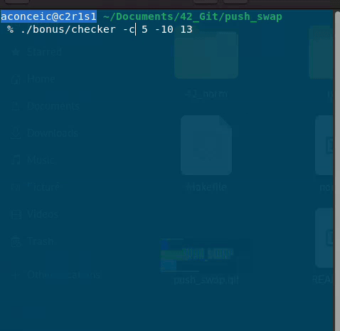

# Push_Swap
 <br>
"This project will make you sort data on a stack, with a limited set of instructions, using
the lowest possible number of actions. To succeed it's necessary to manipulate various
types of algorithms and choose the most appropriate solution (out of many) for an
optimized data sorting."

## Table of contents
- [Introduction](#introduction)
- [Usage](#usage)
- [Sorting Algorithm](#sorting-algorithm)
- [Bonus](#bonus)
- [Bonus Usage](#bonus-usage)
- [Bonus Behaviour](#bonus-behaviour)
- [Makefile Overview](#makefile-overview)
- [License and Thoughtful Advice](#license-and-thoughtful-advice)

## Introduction
The Push Swap project presents a simple yet essential algorithmic task: sorting data efficiently. In this project, we work with a collection of integer values, two stacks, and a set of instructions to manipulate these stacks. Our objective is to develop a C program named push_swap that determines and outputs the shortest sequence of Push Swap language instructions required to sort the given integers.
>The code was written according to the 42 norm guidelines(norminette)

## Usage
1. Considering that you already have cloned the repository, do make bonus
```bash
make bonus
```
This will generate a checker program in your bonus folder, this is the executable of the bonus program.

2. Run the program with the numbers you want as parameters
``` bash
./push_swap 5 -10 13
```
This will return the moviments necessary to organize the stack.
To know more about the rules for moviments, see [Subject](subject) <br>

## Sorting algorithm
This code was written based on an article by **A. Yigit Ogun**. Click [Here](https://medium.com/@ayogun/push-swap-c1f5d2d41e97) if you want to check it out.<br>
A. Yigit Ogun called this "The Turc Algorithm". Essentially, he determines the optimal sequence of moves required to arrange a set of numbers in order, and then performs the sorting accordingly. This method prioritizes efficiency by minimizing the number of moves needed to put the stack in order.
### How does "The Turc Algorithm" works ??
First of all: for the turc algorithm to work we need to have more than 3 numbers on the stack. If we have 3 numbers only, we use a simple sort three algorithm, that is based on all the exiting possibilities to sort 3 numbers. If we have only 2 numbers, then we use a simple "sa", that changes the position of the first and second number of stack a. <br>Again, to know more about the moviments and the rules, please check [Subject](subject). <br>
If we have more than 3 numbers, the turc algorithm takes action.
Explaining in a very simple and direct form how it works:<br>
  - Transfer all elements from STACK_A to STACK_B in descending order. This rearrangement is intended to facilitate automatic sorting when the elements are subsequently pushed back to STACK_A.
  - We perform the transfer from STACK_A to STACK_B until STACK A contains only three numbers.
  - When STACK_A is only with the 3 numbers, we perform a sort three algorithm on STACK_A and send the numbers of STACK_B back to STACK_A.

For a more detailed explanation, I highly recommend for you too read the article [Here](https://medium.com/@ayogun/push-swap-c1f5d2d41e97). <br>
Below, there is an illustration of how this algorithm works. <br>
<br>
If you want to test the program like this, check the [push_swap visualizer](https://github.com/o-reo/push_swap_visualizer).

## Bonus
The bonus requires the creation of a program that reproduces the behaviour of the checker, but not 100% equally. The checker is a program that is given by the 42 school to check if the numbers are sorted.

## Bonus Usage
1. On your terminal, clone the repository
```bash
git clone git@github.com:amauricoder/42_Push_Swap.git
```
2. Do make bonus to compile the bonus files
```bash
make bonus
```
This will generate a checker file in the bonus folder, this is the executable of the bonus program.

3. Run the bonus program with the numbers you want as parameters (Please, check bonus behaviour topic below for more details about the usage of this program).
``` bash
./bonus/checker 5 -10 13
```
## Bonus Behaviour
Upon executing the program, you'll be prompted to input valid movements via the terminal. These movements will determine whether the stack becomes organized as a result.
If the moviment organizes the stack, it will give you an "Ok" as result. If not, it will give you an "KO". If the input is invalid, it will give you an "Error".
Since this bonus part we were asked to create a checker, but not 100% equal to the original checker, I've decided to put some extra features on it. <br>
To access these features, use the following flags on the execution.
| -s | -c |
|----------|:---------:|
| print the stacks   | print in color the last moviment that took action |

Examples of usage of the checker program below:

Normal Usage <br>
>  <br>

Using -s flag <br>
>  <br>

Using -c flag alone and -s and -c together <br>
>  <br>

## Makefile Overview
In this project, the Makefile offers the following essential rules:
- **make**: Compiles the project to push_swap on root folder.
- **make clean**: Cleans the directory by removing `.o` files, preserving `push_swap` executable.
- **make fclean**: Completely cleans the directory by deleting both `.o` files and `push_swap`.
- **make re**: Refreshes `push_swap` by recompiling everything.
- **make valgrind**: Checks for memory leaks(Valgrind program required).
- **make bonus**: Compiles the bonus part to checker on the bonus folder.
- **make bonus_clean**: Clean the bonus `.o` files, preserving the checker executable.
- **make bonus_fclean**: Completely cleans the bonus directory by deleting both `.o` files and `checker`.

## License and Thoughtful Advice
[View License](LICENSE)

Stop deceiving yourself. 
Mere ability to copy code doesn't enhance your skills. This is outside the scope of school purposes. 
Everyone can be a "copy paster," but not everyone can be a programmer. Good luck!
