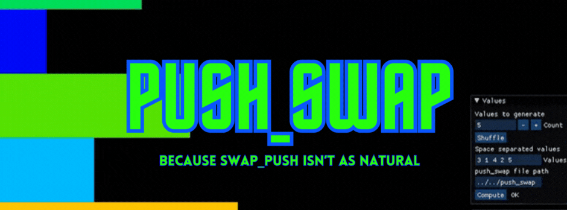

# Push_Swap
 <br>
"This project will make you sort data on a stack, with a limited set of instructions, using
the lowest possible number of actions. To succeed it's necessary to manipulate various
types of algorithms and choose the most appropriate solution (out of many) for an
optimized data sorting."

## Table of contents
- [Introduction](#introduction)
- [Usage](#usage)
- [Obligatory Convertions](#obligatory-convertions)
- [Makefile Overview](#makefile-overview)
- [License and Thoughtful Advice](#license-and-thoughtful-advice)

## Introduction
The Push Swap project presents a simple yet essential algorithmic task: sorting data efficiently. In this project, we work with a collection of integer values, two stacks, and a set of instructions to manipulate these stacks. Our objective is to develop a C program named push_swap that determines and outputs the shortest sequence of Push Swap language instructions required to sort the given integers.
>The code was written according to the 42 norm guidelines(norminette)

## Usage
1. Clone the repository
```bash
git clone git@github.com:amauricoder/42_ft_printf.git
```
2. Do make to compile the files
```bash
make
```
This will generate a libftprintf.a file in the root folder, this is the library containing the ft_printf().

3. Go to your header file and include the library
``` C
# include "ft_printf.h"
```
4. Syntax Example
``` C
  ft_printf("This is a syntax usage example.\n Followed by a number %i.", nbr);
```
## Obligatory convertions
Those are the obligatory conversions requirements of the project - for more detail, check the [subject](subject/2-printf.pdf):
- %c Prints a single character.
- %s Prints a string (as defined by the common C convention).
- %p The void * pointer argument has to be printed in hexadecimal format. • %d Prints a decimal (base 10) number.
- %i Prints an integer in base 10.
- %u Prints an unsigned decimal (base 10) number.
- %x Prints a number in hexadecimal (base 16) lowercase format.
- %X Prints a number in hexadecimal (base 16) uppercase format.
- %% Prints a percent sign.

## Makefile Overview

In this project, the Makefile offers the following essential rules:
- **make**: Compiles the project to libftprintf.a.
- **make clean**: Cleans the directory by removing `.o` files, preserving `libftprintf.a`.
- **make fclean**: Completely cleans the directory by deleting both `.o` files and `libftprintf.a`.
- **make re**: Refreshes `libftprintf.a` by recompiling everything.

## License and Thoughtful Advice
[View License](LICENSE)

Stop deceiving yourself. 
Mere ability to copy code doesn't enhance your skills. This is outside the scope of school purposes. 
Everyone can be a "copy paster," but not everyone can be a programmer. Good luck!
